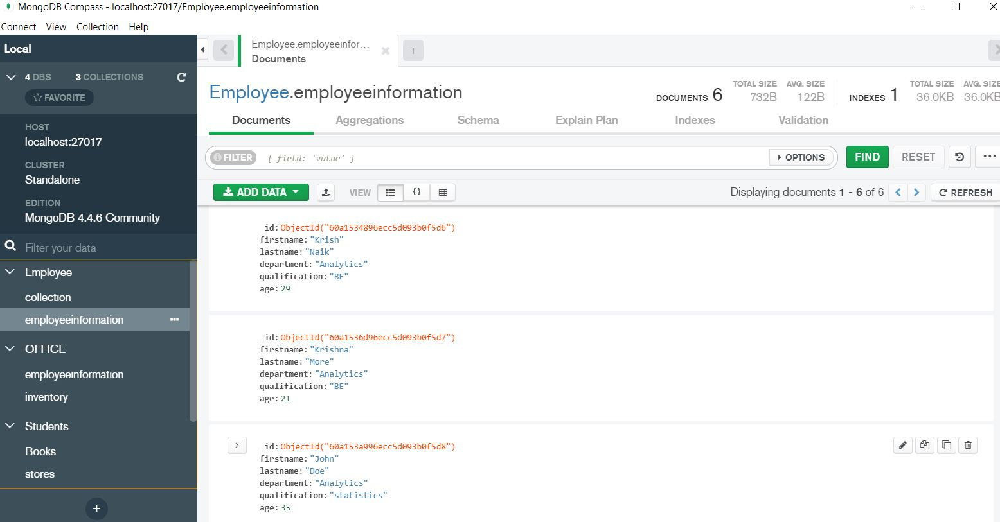

# MongoDB_NoSQL
I have performed all Types of Query Operations using PYMONGO Library.
Python can be used in database applications.
MongoDB stores data in JSON-like documents, which makes the database very flexible and scalable.
One of the most popular NoSQL database is MongoDB.
# PyMongo
Python needs a MongoDB driver to access the MongoDB database.
In this tutorial we will use the MongoDB driver "PyMongo".
We recommend that you use PIP to install "PyMongo".
PIP is most likely already installed in your Python environment.
# MongoDB_Compass

